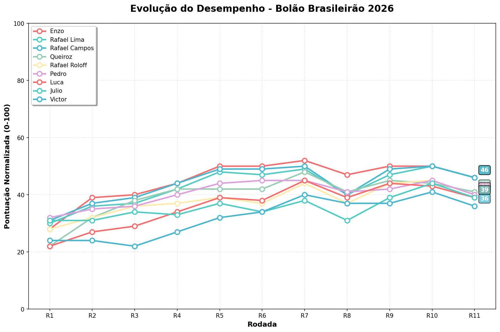

# Bolão Brasileirão 2026

## 🏆 Resultados Atuais

**Última Atualização:** 2026-04-12 11:00:03

| Time | Real | Enzo | Rafael Lima | Rafael Campos | Queiroz | Rafael Roloff | Pedro | Luca | Julio | Victor |
|------|------|------|------|------|------|------|------|------|------|------|
| Palmeiras | 1 | 2°(19p) | 3°(18p) | 3°(18p) | 3°(18p) | 2°(19p) | 3°(18p) | 3°(18p) | 2°(19p) | 3°(18p) |
| Fluminense | 2 | 4°(18p) | 6°(16p) | 7°(15p) | 7°(15p) | 8°(14p) | 4°(18p) | 8°(14p) | 7°(15p) | 10°(12p) |
| São Paulo | 3 | 16°(7p) | 14°(9p) | 12°(11p) | 17°(6p) | 16°(7p) | 15°(8p) | 14°(9p) | 15°(8p) | 16°(7p) |
| Bahia | 4 | 5°(19p) | 4°(20p) | 4°(20p) | 4°(20p) | 6°(18p) | 7°(17p) | 5°(19p) | 5°(19p) | 9°(15p) |
| Flamengo | 5 | 1°(16p) | 1°(16p) | 1°(16p) | 1°(16p) | 1°(16p) | 2°(17p) | 1°(16p) | 1°(16p) | 1°(16p) |
| Atlético-PR | 6 | 17°(9p) | 17°(9p) | 17°(9p) | 15°(11p) | 17°(9p) | 18°(8p) | 17°(9p) | 17°(9p) | 13°(13p) |
| Coritiba | 7 | 15°(12p) | 16°(11p) | 16°(11p) | 12°(15p) | 14°(13p) | 19°(8p) | 20°(7p) | 19°(8p) | 20°(7p) |
| Atlético-MG | 8 | 12°(16p) | 5°(17p) | 5°(17p) | 9°(19p) | 4°(16p) | 13°(15p) | 4°(16p) | 4°(16p) | 2°(14p) |
| Bragantino | 9 | 6°(17p) | 10°(19p) | 10°(19p) | 18°(11p) | 13°(16p) | 9°(20p) | 13°(16p) | 10°(19p) | 15°(14p) |
| Vitória | 10 | 18°(12p) | 18°(12p) | 18°(12p) | 19°(11p) | 18°(12p) | 17°(13p) | 18°(12p) | 16°(14p) | 17°(13p) |
| Grêmio | 11 | 7°(16p) | 7°(16p) | 6°(15p) | 5°(14p) | 12°(19p) | 6°(15p) | 6°(15p) | 18°(13p) | 4°(13p) |
| Vasco | 12 | 9°(17p) | 15°(17p) | 14°(18p) | 10°(18p) | 11°(19p) | 10°(18p) | 9°(17p) | 11°(19p) | 12°(20p) |
| Internacional | 13 | 14°(19p) | 13°(20p) | 15°(18p) | 14°(19p) | 15°(18p) | 14°(19p) | 15°(18p) | 14°(19p) | 6°(13p) |
| Santos | 14 | 11°(17p) | 12°(18p) | 13°(19p) | 13°(19p) | 9°(15p) | 11°(17p) | 7°(13p) | 12°(18p) | 11°(17p) |
| Botafogo | 15 | 10°(15p) | 8°(13p) | 9°(14p) | 11°(16p) | 7°(12p) | 5°(10p) | 11°(16p) | 6°(11p) | 5°(10p) |
| Corinthians | 16 | 8°(12p) | 9°(13p) | 8°(12p) | 6°(10p) | 5°(9p) | 8°(12p) | 10°(14p) | 9°(13p) | 8°(12p) |
| Chapecoense | 17 | 19°(18p) | 19°(18p) | 19°(18p) | 20°(17p) | 19°(18p) | 20°(17p) | 19°(18p) | 20°(17p) | 18°(19p) |
| Remo | 18 | 20°(18p) | 20°(18p) | 20°(18p) | 16°(18p) | 20°(18p) | 16°(18p) | 16°(18p) | 13°(15p) | 19°(19p) |
| Cruzeiro | 19 | 3°(4p) | 2°(3p) | 2°(3p) | 2°(3p) | 3°(4p) | 1°(2p) | 2°(3p) | 3°(4p) | 7°(8p) |
| Mirassol | 20 | 13°(13p) | 11°(11p) | 11°(11p) | 8°(8p) | 10°(10p) | 12°(12p) | 12°(12p) | 8°(8p) | 14°(14p) |
| **TOTAL** | | **294** | **294** | **294** | **284** | **282** | **282** | **280** | **280** | **274** |

### 🏅 Classificação Atual (pontuação normalizada 0-100)

🥇 **Enzo**: 46 pontos<br>
🥈 **Rafael Lima**: 46 pontos<br>
🥉 **Rafael Campos**: 46 pontos<br>
4. **Queiroz**: 41 pontos<br>
5. **Rafael Roloff**: 40 pontos<br>
6. **Pedro**: 40 pontos<br>
7. **Luca**: 39 pontos<br>
8. **Julio**: 39 pontos<br>
9. **Victor**: 36 pontos<br>

### 📈 Histórico de Desempenho



| Rodada | Enzo | Rafael Lima | Rafael Campos | Queiroz | Rafael Roloff | Pedro | Luca | Julio | Victor |
|-------|-------|-------|-------|-------|-------|-------|-------|-------|-------|
| R2 | 39 | 36 | 37 | 32 | 32 | 35 | 27 | 31 | 24 |
| R3 | 40 | 37 | 39 | 38 | 36 | 36 | 29 | 34 | 22 |
| R4 | 44 | 42 | 44 | 42 | 37 | 40 | 34 | 33 | 27 |
| R5 | 50 | 48 | 49 | 42 | 39 | 44 | 39 | 37 | 32 |
| R6 | 50 | 47 | 49 | 42 | 37 | 45 | 38 | 34 | 34 |
| R7 | 52 | 49 | 50 | 48 | 44 | 45 | 45 | 38 | 40 |
| R8 | 47 | 40 | 40 | 41 | 37 | 41 | 39 | 31 | 37 |
| R9 | 50 | 47 | 49 | 45 | 44 | 42 | 44 | 39 | 37 |
| R10 | 50 | 50 | 50 | 44 | 45 | 45 | 43 | 44 | 41 |
| R11 | 46 | 46 | 46 | 41 | 40 | 40 | 39 | 39 | 36 |

**Tendência (últimas 2 medições):**
- **Enzo**: 📉 -4
- **Rafael Lima**: 📉 -4
- **Rafael Campos**: 📉 -4
- **Queiroz**: 📉 -3
- **Rafael Roloff**: 📉 -5
- **Pedro**: 📉 -5
- **Luca**: 📉 -4
- **Julio**: 📉 -5
- **Victor**: 📉 -5

## 🎯 Sistema de Pontuação

Para cada time, os jogadores recebem:
- **20 pontos** para acerto exato da posição
- **19 pontos** para 1 posição de diferença
- **18 pontos** para 2 posições de diferença
- ...até **1 ponto** para 19 posições de diferença
- **0 pontos** para 20 ou mais posições de diferença

Bônus adicionais:
- **+3 pontos** se acertar o **1º colocado**
- **+3 pontos** se acertar **3 dos 4 últimos colocados** (posições 17–20)

**Pontuação total mínima possível:** 200 pontos
**Pontuação total máxima possível:** 406 pontos

**Pontuação final normalizada:**
`pontuação_normalizada = (pontuação_total - 200) * 100 / 206`
O resultado final sempre estará entre 0 e 100.

### Execução Manual
```bash
python scrape_brasileirao_simple.py
```

Ou com um arquivo de previsões customizado:
```bash
python scrape_brasileirao_simple.py minhas_previsoes.json
```

Para forçar atualização (ignorar checagem de mudanças):
```bash
python scrape_brasileirao_simple.py force
```

### Execução Automatizada (Windows)
Use o arquivo `update_bolao.bat` para execução automatizada com Git:

```batch
# Execução normal
update_bolao.bat

# Forçar atualização
update_bolao.bat -f
```
