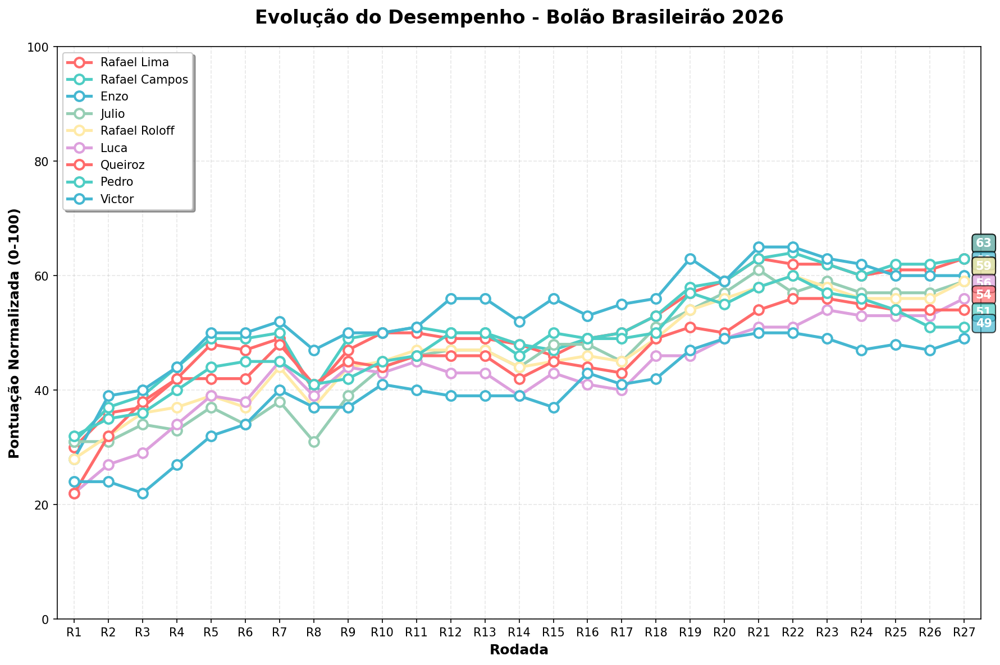

# Bolão Brasileirão 2026

## 🏆 Resultados Atuais

**Última Atualização:** 2026-05-26 11:00:03

| Time | Real | Enzo | Rafael Lima | Rafael Campos | Pedro | Julio | Rafael Roloff | Queiroz | Victor | Luca |
|------|------|------|------|------|------|------|------|------|------|------|
| Palmeiras | 1 | 2°(19p) | 3°(18p) | 3°(18p) | 3°(18p) | 2°(19p) | 2°(19p) | 3°(18p) | 3°(18p) | 3°(18p) |
| Flamengo | 2 | 1°(19p) | 1°(19p) | 1°(19p) | 2°(20p) | 1°(19p) | 1°(19p) | 1°(19p) | 1°(19p) | 1°(19p) |
| Fluminense | 3 | 4°(19p) | 6°(17p) | 7°(16p) | 4°(19p) | 7°(16p) | 8°(15p) | 7°(16p) | 10°(13p) | 8°(15p) |
| Atlético-PR | 4 | 17°(7p) | 17°(7p) | 17°(7p) | 18°(6p) | 17°(7p) | 17°(7p) | 15°(9p) | 13°(11p) | 17°(7p) |
| Bragantino | 5 | 6°(19p) | 10°(15p) | 10°(15p) | 9°(16p) | 10°(15p) | 13°(12p) | 18°(7p) | 15°(10p) | 13°(12p) |
| Coritiba | 6 | 15°(11p) | 16°(10p) | 16°(10p) | 19°(7p) | 19°(7p) | 14°(12p) | 12°(14p) | 20°(6p) | 20°(6p) |
| São Paulo | 7 | 16°(11p) | 14°(13p) | 12°(15p) | 15°(12p) | 15°(12p) | 16°(11p) | 17°(10p) | 16°(11p) | 14°(13p) |
| Bahia | 8 | 5°(17p) | 4°(16p) | 4°(16p) | 7°(19p) | 5°(17p) | 6°(18p) | 4°(16p) | 9°(19p) | 5°(17p) |
| Cruzeiro | 9 | 3°(14p) | 2°(13p) | 2°(13p) | 1°(12p) | 3°(14p) | 3°(14p) | 2°(13p) | 7°(18p) | 2°(13p) |
| Botafogo | 10 | 10°(20p) | 8°(18p) | 9°(19p) | 5°(15p) | 6°(16p) | 7°(17p) | 11°(19p) | 5°(15p) | 11°(19p) |
| Vitória | 11 | 18°(13p) | 18°(13p) | 18°(13p) | 17°(14p) | 16°(15p) | 18°(13p) | 19°(12p) | 17°(14p) | 18°(13p) |
| Atlético-MG | 12 | 12°(20p) | 5°(13p) | 5°(13p) | 13°(19p) | 4°(12p) | 4°(12p) | 9°(17p) | 2°(10p) | 4°(12p) |
| Internacional | 13 | 14°(19p) | 13°(20p) | 15°(18p) | 14°(19p) | 14°(19p) | 15°(18p) | 14°(19p) | 6°(13p) | 15°(18p) |
| Grêmio | 14 | 7°(13p) | 7°(13p) | 6°(12p) | 6°(12p) | 18°(16p) | 12°(18p) | 5°(11p) | 4°(10p) | 6°(12p) |
| Corinthians | 15 | 8°(13p) | 9°(14p) | 8°(13p) | 8°(13p) | 9°(14p) | 5°(10p) | 6°(11p) | 8°(13p) | 10°(15p) |
| Vasco | 16 | 9°(13p) | 15°(19p) | 14°(18p) | 10°(14p) | 11°(15p) | 11°(15p) | 10°(14p) | 12°(16p) | 9°(13p) |
| Santos | 17 | 11°(14p) | 12°(15p) | 13°(16p) | 11°(14p) | 12°(15p) | 9°(12p) | 13°(16p) | 11°(14p) | 7°(10p) |
| Mirassol | 18 | 13°(15p) | 11°(13p) | 11°(13p) | 12°(14p) | 8°(10p) | 10°(12p) | 8°(10p) | 14°(16p) | 12°(14p) |
| Remo | 19 | 20°(19p) | 20°(19p) | 20°(19p) | 16°(17p) | 13°(14p) | 20°(19p) | 16°(17p) | 19°(20p) | 16°(17p) |
| Chapecoense | 20 | 19°(19p) | 19°(19p) | 19°(19p) | 20°(20p) | 20°(20p) | 19°(19p) | 20°(20p) | 18°(18p) | 19°(19p) |
| **TOTAL** | | **314** | **304** | **302** | **300** | **292** | **292** | **288** | **284** | **282** |

### 🏅 Classificação Atual (pontuação normalizada 0-100)

🥇 **Enzo**: 55 pontos<br>
🥈 **Rafael Lima**: 50 pontos<br>
🥉 **Rafael Campos**: 50 pontos<br>
4. **Pedro**: 49 pontos<br>
5. **Julio**: 45 pontos<br>
6. **Rafael Roloff**: 45 pontos<br>
7. **Queiroz**: 43 pontos<br>
8. **Victor**: 41 pontos<br>
9. **Luca**: 40 pontos<br>

### 📈 Histórico de Desempenho



| Rodada | Enzo | Rafael Lima | Rafael Campos | Pedro | Julio | Rafael Roloff | Queiroz | Victor | Luca |
|-------|-------|-------|-------|-------|-------|-------|-------|-------|-------|
| R8 | 47 | 40 | 40 | 41 | 31 | 37 | 41 | 37 | 39 |
| R9 | 50 | 47 | 49 | 42 | 39 | 44 | 45 | 37 | 44 |
| R10 | 50 | 50 | 50 | 45 | 44 | 45 | 44 | 41 | 43 |
| R11 | 51 | 50 | 51 | 46 | 46 | 47 | 46 | 40 | 45 |
| R12 | 56 | 49 | 50 | 50 | 47 | 47 | 46 | 39 | 43 |
| R13 | 56 | 49 | 50 | 50 | 47 | 47 | 46 | 39 | 43 |
| R14 | 52 | 48 | 48 | 46 | 44 | 44 | 42 | 39 | 39 |
| R15 | 56 | 46 | 47 | 50 | 48 | 45 | 45 | 37 | 43 |
| R16 | 53 | 49 | 49 | 49 | 48 | 46 | 44 | 43 | 41 |
| R17 | 55 | 50 | 50 | 49 | 45 | 45 | 43 | 41 | 40 |

**Tendência (últimas 2 medições):**
- **Enzo**: 📈 +2
- **Rafael Lima**: 📈 +1
- **Rafael Campos**: 📈 +1
- **Pedro**: ➡️ =0
- **Julio**: 📉 -3
- **Rafael Roloff**: 📉 -1
- **Queiroz**: 📉 -1
- **Victor**: 📉 -2
- **Luca**: 📉 -1

## 🎯 Sistema de Pontuação

Para cada time, os jogadores recebem:
- **20 pontos** para acerto exato da posição
- **19 pontos** para 1 posição de diferença
- **18 pontos** para 2 posições de diferença
- ...até **1 ponto** para 19 posições de diferença
- **0 pontos** para 20 ou mais posições de diferença

Bônus adicionais:
- **+3 pontos** se acertar o **1º colocado**
- **+3 pontos** se acertar **3 dos 4 últimos colocados** (posições 17–20)

**Pontuação total mínima possível:** 200 pontos
**Pontuação total máxima possível:** 406 pontos

**Pontuação final normalizada:**
`pontuação_normalizada = (pontuação_total - 200) * 100 / 206`
O resultado final sempre estará entre 0 e 100.

### Execução Manual
```bash
python scrape_brasileirao_simple.py
```

Ou com um arquivo de previsões customizado:
```bash
python scrape_brasileirao_simple.py minhas_previsoes.json
```

Para forçar atualização (ignorar checagem de mudanças):
```bash
python scrape_brasileirao_simple.py force
```

### Execução Automatizada (Windows)
Use o arquivo `update_bolao.bat` para execução automatizada com Git:

```batch
# Execução normal
update_bolao.bat

# Forçar atualização
update_bolao.bat -f
```
