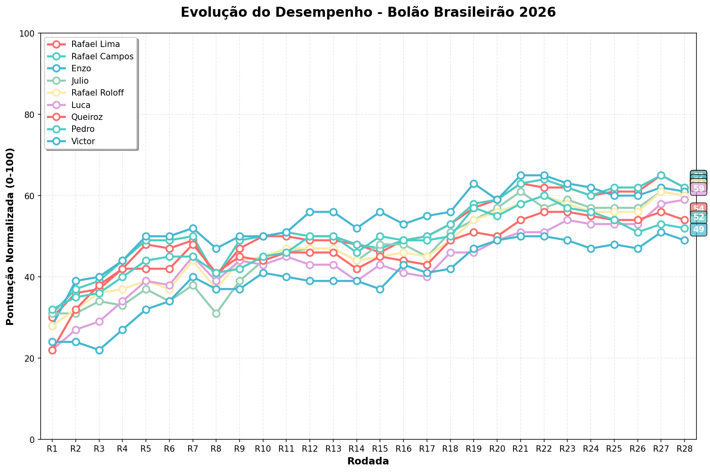

# Bolão Brasileirão 2026

## 🏆 Resultados Atuais

**Última Atualização:** 2026-10-09 11:00:07

| Time | Real | Rafael Campos | Julio | Rafael Lima | Rafael Roloff | Enzo | Luca | Queiroz | Pedro | Victor |
|------|------|------|------|------|------|------|------|------|------|------|
| Flamengo | 1 | 1°(20p) | 1°(20p) | 1°(20p) | 1°(20p) | 1°(20p) | 1°(20p) | 1°(20p) | 2°(19p) | 1°(20p) |
| Palmeiras | 2 | 3°(19p) | 2°(20p) | 3°(19p) | 2°(20p) | 2°(20p) | 3°(19p) | 3°(19p) | 3°(19p) | 3°(19p) |
| Fluminense | 3 | 7°(16p) | 7°(16p) | 6°(17p) | 8°(15p) | 4°(19p) | 8°(15p) | 7°(16p) | 4°(19p) | 10°(13p) |
| Atlético-PR | 4 | 17°(7p) | 17°(7p) | 17°(7p) | 17°(7p) | 17°(7p) | 17°(7p) | 15°(9p) | 18°(6p) | 13°(11p) |
| Cruzeiro | 5 | 2°(17p) | 3°(18p) | 2°(17p) | 3°(18p) | 3°(18p) | 2°(17p) | 2°(17p) | 1°(16p) | 7°(18p) |
| Bahia | 6 | 4°(18p) | 5°(19p) | 4°(18p) | 6°(20p) | 5°(19p) | 5°(19p) | 4°(18p) | 7°(19p) | 9°(17p) |
| Atlético-MG | 7 | 5°(18p) | 4°(17p) | 5°(18p) | 4°(17p) | 12°(15p) | 4°(17p) | 9°(18p) | 13°(14p) | 2°(15p) |
| Santos | 8 | 13°(15p) | 12°(16p) | 12°(16p) | 9°(19p) | 11°(17p) | 7°(19p) | 13°(15p) | 11°(17p) | 11°(17p) |
| Coritiba | 9 | 16°(13p) | 19°(10p) | 16°(13p) | 14°(15p) | 15°(14p) | 20°(9p) | 12°(17p) | 19°(10p) | 20°(9p) |
| Bragantino | 10 | 10°(20p) | 10°(20p) | 10°(20p) | 13°(17p) | 6°(16p) | 13°(17p) | 18°(12p) | 9°(19p) | 15°(15p) |
| São Paulo | 11 | 12°(19p) | 15°(16p) | 14°(17p) | 16°(15p) | 16°(15p) | 14°(17p) | 17°(14p) | 15°(16p) | 16°(15p) |
| Vitória | 12 | 18°(14p) | 16°(16p) | 18°(14p) | 18°(14p) | 18°(14p) | 18°(14p) | 19°(13p) | 17°(15p) | 17°(15p) |
| Botafogo | 13 | 9°(16p) | 6°(13p) | 8°(15p) | 7°(14p) | 10°(17p) | 11°(18p) | 11°(18p) | 5°(12p) | 5°(12p) |
| Vasco | 14 | 14°(20p) | 11°(17p) | 15°(19p) | 11°(17p) | 9°(15p) | 9°(15p) | 10°(16p) | 10°(16p) | 12°(18p) |
| Mirassol | 15 | 11°(16p) | 8°(13p) | 11°(16p) | 10°(15p) | 13°(18p) | 12°(17p) | 8°(13p) | 12°(17p) | 14°(19p) |
| Corinthians | 16 | 8°(12p) | 9°(13p) | 9°(13p) | 5°(9p) | 8°(12p) | 10°(14p) | 6°(10p) | 8°(12p) | 8°(12p) |
| Internacional | 17 | 15°(18p) | 14°(17p) | 13°(16p) | 15°(18p) | 14°(17p) | 15°(18p) | 14°(17p) | 14°(17p) | 6°(9p) |
| Grêmio | 18 | 6°(8p) | 18°(20p) | 7°(9p) | 12°(14p) | 7°(9p) | 6°(8p) | 5°(7p) | 6°(8p) | 4°(6p) |
| Remo | 19 | 20°(19p) | 13°(14p) | 20°(19p) | 20°(19p) | 20°(19p) | 16°(17p) | 16°(17p) | 16°(17p) | 19°(20p) |
| Chapecoense | 20 | 19°(19p) | 20°(20p) | 19°(19p) | 19°(19p) | 19°(19p) | 19°(19p) | 20°(20p) | 20°(20p) | 18°(18p) |
| **TOTAL** | | **327** | **325** | **325** | **325** | **323** | **319** | **309** | **308** | **301** |

### 🏅 Classificação Atual (pontuação normalizada 0-100)

🥇 **Rafael Campos** (+3): 62 pontos<br>
🥈 **Julio** (+3): 61 pontos<br>
🥉 **Rafael Lima** (+3): 61 pontos<br>
4. **Rafael Roloff** (+3): 61 pontos<br>
5. **Enzo** (+3): 60 pontos<br>
6. **Luca** (+3): 58 pontos<br>
7. **Queiroz** (+3): 53 pontos<br>
8. **Pedro**: 52 pontos<br>
9. **Victor** (+3): 49 pontos<br>

### 📈 Histórico de Desempenho



| Rodada | Rafael Campos | Julio | Rafael Lima | Rafael Roloff | Enzo | Luca | Queiroz | Pedro | Victor |
|-------|-------|-------|-------|-------|-------|-------|-------|-------|-------|
| R20 | 59 | 57 | 59 | 56 | 59 | 49 | 50 | 55 | 49 |
| R21 | 63 | 61 | 63 | 58 | 65 | 51 | 54 | 58 | 50 |
| R22 | 64 | 57 | 62 | 60 | 65 | 51 | 56 | 60 | 50 |
| R23 | 62 | 59 | 62 | 58 | 63 | 54 | 56 | 57 | 49 |
| R24 | 60 | 57 | 60 | 56 | 62 | 53 | 55 | 56 | 47 |
| R25 | 62 | 57 | 61 | 56 | 60 | 53 | 54 | 54 | 48 |
| R26 | 62 | 57 | 61 | 56 | 60 | 53 | 54 | 51 | 47 |
| R27 | 65 | 61 | 65 | 61 | 62 | 58 | 56 | 53 | 51 |
| R28 | 62 | 60 | 62 | 61 | 60 | 59 | 54 | 51 | 50 |
| R29 | 62 | 61 | 61 | 61 | 60 | 58 | 53 | 52 | 49 |

**Tendência (últimas 2 medições):**
- **Rafael Campos**: ➡️ =0
- **Julio**: 📈 +1
- **Rafael Lima**: 📉 -1
- **Rafael Roloff**: ➡️ =0
- **Enzo**: ➡️ =0
- **Luca**: 📉 -1
- **Queiroz**: 📉 -1
- **Pedro**: 📈 +1
- **Victor**: 📉 -1

## 🎯 Sistema de Pontuação

Para cada time, os jogadores recebem:
- **20 pontos** para acerto exato da posição
- **19 pontos** para 1 posição de diferença
- **18 pontos** para 2 posições de diferença
- ...até **1 ponto** para 19 posições de diferença
- **0 pontos** para 20 ou mais posições de diferença

Bônus adicionais:
- **+3 pontos** se acertar o **1º colocado**
- **+3 pontos** se acertar **3 dos 4 últimos colocados** (posições 17–20)

**Pontuação total mínima possível:** 200 pontos
**Pontuação total máxima possível:** 406 pontos

**Pontuação final normalizada:**
`pontuação_normalizada = (pontuação_total - 200) * 100 / 206`
O resultado final sempre estará entre 0 e 100.

### Execução Manual
```bash
python scrape_brasileirao_simple.py
```

Ou com um arquivo de previsões customizado:
```bash
python scrape_brasileirao_simple.py minhas_previsoes.json
```

Para forçar atualização (ignorar checagem de mudanças):
```bash
python scrape_brasileirao_simple.py force
```

### Execução Automatizada (Windows)
Use o arquivo `update_bolao.bat` para execução automatizada com Git:

```batch
# Execução normal
update_bolao.bat

# Forçar atualização
update_bolao.bat -f
```
